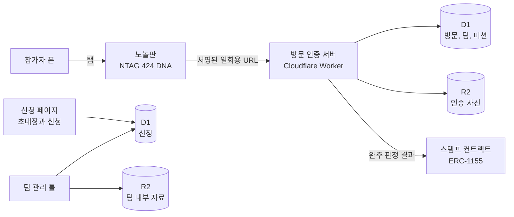

# 노놀 (NoNol)

노원구를 놀이터로 만드는 청년 참여형 실물 퀘스트. 노놀이 설계한 미션을 친구와 동네 가게 세 곳에서 수행하고, 떠나기 전 노놀판(NFC)에 폰을 대 마무리하면 디지털 여권에 도장이 찍힌다. 참가비는 전액 결식 아동을 위해 기부할 예정이다.

2026 광운대학교 KW 해커톤 36조. 슬로건은 "노원구를 놀이터로, 노놀", 부 슬로건은 "재미를 가지다, 노놀 (Have fun, Nonol)"

## 이 저장소에 올리는 것

확실한 것만 올린다. 기준은 네 가지다.

| 기준 | 뜻 |
| --- | --- |
| 실제로 쓰는 것 | 개발이 끝나 지금 돌아가고 있는 것 |
| 실제로 알린 것 | 밖에 내보내 사람들이 본 홍보물 |
| 실제 리소스 | 지금 쓰고 있는 로고 같은 자산 |
| 정제된 데이터 | 조사해서 정리를 마친 자료와 집계 |

완성되어 실제로 쓰는 것을 올린다. 폴더마다 맡은 역할과 앞으로 들어올 것을 안내에 적어 두었다.

## 지금 들어 있는 것

| 폴더 | 들어 있는 것 | 기준 |
| --- | --- | --- |
| [research/](research/) | 유사 서비스 조사 (국내, 해외) | 정제된 데이터 |
| [research/user_research/](research/user_research/) | 할인 및 쿠폰 서비스 이용 경험 설문. 설계, 설문 사이트, 모집 글 | 실제로 쓰는 것 |
| [marketing/](marketing/) | 소개 영상, 팀원 모집 글 | 실제로 알린 것 |
| [design/logo/](design/logo/) | 로고 | 실제 리소스 |
| [product/wireframe/](product/wireframe/) | 와이어프레임과 기능명세. 매니패스트로 받은 초안, 팀 기준으로 교정한 판, 교정 기록, 화면 캡처 | 정제된 데이터 |
| [product/alpha/](product/alpha/) | 묵언수행 알파 신청 페이지, 4명 사진, 신청 API와 DB 스키마. [배포 페이지](https://nonol-alpha.1991knet.workers.dev/v2/) | 실제로 쓰는 것 |
| [product/game-lab/](product/game-lab/) | 팀 모바일 퀘스트의 독립 모듈 시험과 고정 코스 연결 시험. [Test Lab](https://nonol-game-lab.1991knet.workers.dev) | 실제로 쓰는 것 |
| [product/game/](product/game/) | Test Lab이 사용하는 공유 팀 방 정책, 상태 로직과 확정 서비스 흐름 | 정제된 정책과 실제로 쓰는 코드 |
| [docs/](docs/) | 확정 서비스 흐름과 정책 문서의 안내 | 확정된 문서 |
| [team/](team/) | 팀 도구가 들어올 자리 | |

## 1. 문제 의식

지역 방문을 유도하는 서비스들은 할인과 쿠폰을 앞세운다. 우리는 사람들이 그곳에 가고 싶어지는 이유부터 생각했다. 친구와 재미있는 일을 하고, 함께한 추억을 만드는 것이다.

그래서 노놀은 "얼마나 싸게 이용할 수 있는가"보다 "여기서 어떤 재미있는 경험을 할 수 있는가"를 제안한다.

문제 가설: 사람들과 함께 하는 경험이 방문의 이유가 된다.

동네에는 재미의 소재가 될 공간과 이야기가 흩어져 있다. 노놀은 이 소재를 모아, 친구와 무엇을 하고 어떻게 놀지 직접 설계한다. 공간과 가게는 무대이고, 놀이를 설계하는 주체는 노놀이다.

| 경험으로 방문할 이유를 만들려면 | 필요한 요구사항 |
| --- | --- |
| 그 장소에서 친구와 하고 싶은 활동이 있어야 한다 | 장소에 어울리는 미션, 역할과 이야기 |
| 설계한 놀이를 현장에서 이어갈 수 있어야 한다 | 할 일과 다음 순서를 알려주는 안내 |
| 함께한 경험을 추억으로 남길 수 있어야 한다 | 경험을 남길 수 있는 기록 |

이 가설이 맞는지는 묻고 확인한다. 설문으로 할인과 쿠폰 서비스를 써 본 사람이 계속 쓰는지, 그만뒀다면 왜 그만뒀는지를 모으고 있다. 문항과 설계 의도는 [설문 설계](research/user_research/) 에 있다.

## 2. 어떻게 푸는가

묵언수행 알파 신청 페이지는 product/alpha에 있으며 트랙 소개와 신청 저장을 제공한다. 팀 모바일 퀘스트는 [Test Lab](https://nonol-game-lab.1991knet.workers.dev)에서 검증한다. 실행 코드는 product/game-lab, 공유 팀 방 정책과 게임 기획은 product/game에서 관리한다. 와이어프레임과 기능명세는 product/wireframe에 있다.

### 2.1 제품

묵언수행의 확정 흐름은 [서비스 흐름 SSOT](product/game/docs/261009_0313_서비스흐름_정책_SSOT.md)에서 관리한다.

1. 기존 그룹 2명 이상이 날짜와 시간을 정해 신청한다. 가격은 8,000원이며 1인 또는 그룹 적용 단위는 확인 대기다.
2. 당일 카카오톡 안내 링크로 입장하고 외부 브라우저 사용 안내를 확인한다. 첫 입장자가 팀장이 된다.
3. 이층집에서 식사하고 전원이 노놀판을 태그한다. 전원 준비와 태그 후 팀장이 시작한다.
4. 2D 지도로 우이천 초입에 이동해 제시 물체를 사진 인증하고 묵언 규칙을 확인한다.
5. 우이천에서 AR 길을 따라 말없이 걸으며 말한 팀원을 신고한다. 솥고집 정령을 만나 터치하고 카페 추천 이야기를 본다.
6. 지도 없이 거리, 방향과 색을 따라 카페를 찾는다. 커피 주문 후 전원이 노놀판을 태그하고 완주 및 벌점 엔딩을 확인한다.

세 이동 구간은 전원 도착 확인 후 함께 다음 화면으로 전환한다. 이 목록은 확정한 서비스 경험이다. 신청 DB와 게임 방 연결, 카카오톡 자동 발송, 카페 주문 확인 및 마지막 NFC 연결은 후속 개발 범위다.

Test Lab에서는 [독립 모듈 시험](https://nonol-game-lab.1991knet.workers.dev)과 [고정 코스 시험](https://nonol-game-lab.1991knet.workers.dev/tracks)을 구분한다. 모듈 방은 시작 후 팀장이 각 모듈의 위치, 반경 또는 기준 사진을 설정한다. 고정 코스는 관리자가 등록한 복지관, 광운스퀘어, 비마관 앞과 풋살장을 연결하고 방 생성 당시 버전을 유지한다. Test Lab은 한 명도 준비 후 시작할 수 있다.

사장님이 할 일은 판 하나를 계산대에 두는 것뿐이다.

### 2.2 기술: NFC 와 블록체인

노놀의 기술은 두 가지 질문에 답한다. 정말 그 자리에 있었는가, 그리고 그 기록을 믿을 수 있는가.

| 기술 | 답하는 질문 | 구현된 것 | 다음 단계 |
| --- | --- | --- | --- |
| NFC (NTAG 424 DNA) | 정말 그 자리에 있었는가 | 태그가 탭마다 만드는 서명(SUN, AES-CMAC)을 서버가 검증한다. 한 번 쓴 값은 다시 쓸 수 없어 사진이나 링크 복사로 통과할 수 없다. 위치 반경 판정, 팀 전원 조건, 역할과 비밀 임무, 공개 여권까지 구현했다. 실물 태그와 아이폰으로 서버 검증에 성공했고 시험 서버에 배포했다. 자동 시험 33개 통과 | 태그의 키를 공장 기본값에서 노놀 전용 키로 교체 |
| 블록체인 (ERC-1155) | 그 기록을 믿을 수 있는가 | 완주 도장을 전송할 수 없는 토큰으로 발행하는 컨트랙트(NonolStamp.sol)와 발행 데모. 발행은 서버 지갑만, 전송 불가, 본인 소각만 가능, 중복 보유 불가 | Base 테스트넷 배포, 발행 코드를 Worker 로 이전 |

완주 판정은 서버가 하고, 체인은 판정이 끝난 결과만 받아 적는다. 체인을 빼도 서비스는 돌아가며, 체인은 기록의 증명을 맡는다.

### 2.3 구성도

서버는 Cloudflare Workers를 사용한다. 신청 데이터와 파일은 D1 및 R2에 두고, Test Lab의 팀 방 상태는 Durable Objects의 SQLite에서 관리하며 WebSocket으로 공유한다.

| 구성 요소 | 하는 일 | 스택 |
| --- | --- | --- |
| 방문 인증 서버 | 방문 인증과 퀘스트 진행, 여권 | Workers, D1, R2 |
| 스탬프 컨트랙트 | 완주 도장 발행 데모 | Solidity, Hardhat, OpenZeppelin, viem |
| 신청 페이지 | 알파 테스터 초대장과 신청 | Workers, D1 |
| Test Lab | 팀 방 동기화, 지도와 사진 인증, 신고, 정령, 탐색과 정산 시험 | Workers, Durable Objects, SQLite, WebSocket, 카카오 지도 |
| 팀 관리 툴 | 할 일, 달력, 문서 관리 | Workers, D1, R2 |

### 2.4 홍보

홍보물은 AI 와 코드로 만든다.

- 소개 영상은 화면 캡처(Playwright), HTML 타임라인(GSAP), 프레임 렌더, 배경음 생성(MusicGen), 나레이션 생성(edge-tts), 합성(ffmpeg)을 스크립트로 이어 만든다. 문구를 바꾸면 명령 몇 줄로 영상이 다시 나온다. 과정은 [marketing/README.md](marketing/README.md) 에 있다.
- 영상을 싸게 여러 판 만들 수 있으므로, 만든 뒤에는 가벼운 A/B 테스트로 어느 판이 반응이 좋은지 본다.
- 반응은 신청 폼의 유입 경로, 초대 링크의 추천인 기록, 설문으로 모은다. 설문은 [research/user_research/](research/user_research/) 에서 관리한다.

### 2.5 기부

참가비는 전액 결식 아동을 위해 기부할 예정이다. 놀이터에는 아이들이 놀아야 하는데, 밥을 못 먹어서 못 노는 아이가 있으면 안 되기 때문이다. 기부처와 내역 공개 방식은 정식 운영 전에 정한다.

## 3. 팀

| 이름 | 역할 |
| --- | --- |
| 박민석 | 팀장, 기획, AI 활용 제작 |
| 박서현 | 기획과 개발 |
| 임유진 | 데이터와 기획 |

### 왜 이 팀인가

- 노놀 아이템으로 CHIC 아이디어톤에서 1등을 했다 (심사: 디자인노블 대표, CTO).
- 필요한 제품이 있으면 만든다. NFC 검증, 블록체인 스탬프 로컬 검증, 팀 리소스 관리 툴, 설문 도구, 소개 영상을 AI 를 활용해 짧은 시간에 만들었다.
- 만들 수 있고 알릴 수 있다. 개발과 홍보를 팀 안에서 모두 한다.
- 손발이 맞는다. 박민석과 임유진은 이전 해커톤을 함께 치렀다.
- 이 주제를 좋아한다. 게임, 엔터테인먼트, 아이데이션에 관심이 많은 사람들이 모였다.
- 사람이 좋다. 서로 믿고 맡길 수 있다.

### 팀장 박민석

아이디어를 실제로 돌아가는 제품으로 만들어 본 경험이 있다.

- 멜리사 (AI 대화 자동 일기 앱): PM 으로 프로토타입 개발과 팀 운영. 캠퍼스타운 선정, 창업보육투자유치 IR 경연회 장려상
- 온담 (독거 노인 AI 안부전화): 풀스택 프로토타입. KDB 소셜임팩트 아이디어 공모전 IR 우수상
- CSI-Guard (와이파이 신호로 독거 노인 낙상 감지): 풀스택과 영상 제작. ICT AWARD KOREA 2026 은상
- Radio-gemma, 병리 이미지 Annotation tool: 팀 요구에 맞춘 제품 제작

### 팀원 모집은 이렇게 했다

노놀이 무엇인지 보여 주는 사이트와 영상을 먼저 만들고, 그것을 들고 사람을 모았다.

| 무엇 | 어디 | 만든 때 |
| --- | --- | --- |
| 노놀 소개 사이트 | https://nonol.1991knet.workers.dev | 2026-09-09 ~ 09-15 |
| 노놀 스토리 사이트 | https://nonol-story.1991knet.workers.dev | 같은 시기 |
| 팀원 모집 글 | [marketing/recruit/chic_recruit_post.md](marketing/recruit/chic_recruit_post.md) | 2026-09-14 |
| 소개 영상 42.8초 | [영상 보기](marketing/promo/nonol-promo-42s-v2-bgm-sfx-나레이션.mp4?raw=true), [기획안](marketing/노놀_소개영상_기획안_v1.0.md) | 2026-09-16 ~ 09-17 |

두 사이트는 해커톤 개회식(2026-09-16) 전에 만든 것이다. 대회 규정상 개회식 전에 작성한 코드는 인정되지 않으므로 제품 코드로 쓰지 않았고, 심사 대상도 아니다. 팀을 어떻게 모았는지 보여 주는 기록으로 남긴다.

## 4. 일하는 방식

### 가설을 세우고 빠르게 돌린다

노놀은 검증할 것이 많은 단계다. 철학과 온톨로지는 가설로 두고, 작게 만들어 돌려 보며 맞은 것만 남긴다.

지금 검증하는 가설은 세 가지다.

1. 대학생은 친구와 퀘스트를 깨는 경험에 1인 1만원 안팎을 낸다.
2. 완주 인증샷은 자발적으로 올라가고, 그 게시물이 다음 팀을 데려온다.
3. 사장님은 손님 유입을 대가로 장소 제공에 동의한다.

용어는 팀이 같은 말을 쓰기 위한 최소한만 정해 두었다 (트랙, 퀘스트, 스탬프, 여권, 팀, 인증, 제휴 장소).

### 아이디어를 구조로 만든다

트랙은 가게 카드와 퀘스트 틀을 조립해 만든다.

- 가게 카드: 그 가게에서 할 수 있는 것, 사장님이 허락한 활동
- 퀘스트 틀: 인원, 시간, 조건, 인증 방식
- 트랙: 가게 카드와 퀘스트 틀을 곱한 것. 운영 기록은 다시 카드로 돌아온다

새 동네로 갈 때는 틀은 그대로 두고 가게 카드만 새로 만든다. 지금은 손으로 조립하고, 트랙이 쌓이면 AI 가 초안을 쓰게 한다. 구현에서는 트랙 하나가 JSON 파일 하나다.

### AI 와 함께 만든다

코드는 바이브 코딩으로 작성했다. Claude Fable 5.1 과 Codex GPT-6 Astra 를 썼다. 사람은 무엇을 왜 만드는지 정하고 결과를 확인하며, AI 는 구현과 기록을 맡는다.

- 요청과 결정을 문서로 남긴 뒤 구현한다.

### 팀 운영

팀 관리 툴을 직접 만들어 쓴다. 대시보드, 회의록, 달력, 문서, 파일 보기가 있고, 회의록의 후속 행동이 할 일로 모인다.

## 5. 지식 관리와 저장소 구조

이 저장소는 코드 저장소이기 전에 팀의 지식 저장소다. 트리는 지식 관리를 중심으로 짰고, 폴더마다 맡은 핵심이 하나씩 있다.

| 폴더 | 핵심 |
| --- | --- |
| [product/](product/) | 참가자가 쓰는 제품 |
| [team/](team/) | 팀이 일하는 도구와 기록 |
| [design/](design/) | 로고, 굿즈 도안, 개념 스케치 |
| [docs/](docs/) | 제품 정의, 기획, 대회 제출물 |
| [research/](research/) | 유사 서비스 조사, 유저 리서치(설문) |
| [marketing/](marketing/) | 소개 영상, 모집 글, 홍보물 제작 파이프라인 |

지키는 규칙은 적다.

- 새 파일 이름 앞에 작성 시각(YYMMDD_HHMM_)을 붙인다. 폴더를 열면 일의 순서가 보인다.
- 기획과 결정은 md 로, 그림은 HTML 로 만들어 저장소에서 관리한다.
- 비밀값과 개인정보는 저장소 밖에서 관리한다.

폴더별 역할은 각 폴더의 안내에 있다.

## 6. 작성 시기

제품 코드는 2026 KW 해커톤 개회식(2026-09-16) 뒤에 작성했다.
