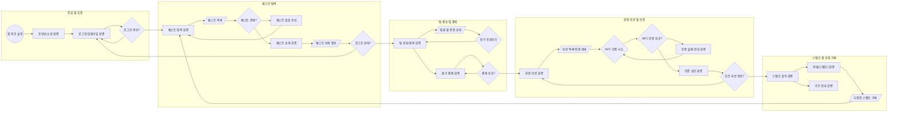

```mermaid
flowchart LR

  subgraph s1 ["진입 및 인증"]
    n1(("앱 최초 실행"))
    n2["온보딩/소개 화면"]
    n3["로그인/회원가입 화면"]
    n4{"로그인 여부?"}
  end

  subgraph s2 ["퀘스트 탐색"]
    n5["퀘스트 탐색 화면"]
    n6[/"퀘스트 목록"/]
    n7{"퀘스트 존재?"}
    n8["퀘스트 없음 안내"]
    n9["퀘스트 상세 화면"]
    n10[/"퀘스트 상세 정보"/]
    n11{"로그인 상태?"}
  end

  subgraph s3 ["팀 결성 및 결제"]
    n12["팀 생성/참여 화면"]
    n13[/"팀원 및 진행 상태"/]
    n14{"친구 초대하기"}
    n15["참가 결제 화면"]
    n16{"결제 성공?"}
  end

  subgraph s4 ["현장 미션 및 인증"]
    n17["현장 미션 화면"]
    n18[/"미션 목록/진행 상태"/]
    n19{"NFC 인증 시도"}
    n20{"NFC 인증 성공?"}
    n21["인증 실패 안내 화면"]
    n22["인증 성공 화면"]
    n23{"모든 미션 완료?"}
  end

  subgraph s5 ["스탬프 및 성취 기록"]
    n24["스탬프 획득 화면"]
    n25["여권(스탬프) 화면"]
    n26[/"수집된 스탬프 기록"/]
    n27["기부 안내 화면"]
  end

  n1 --> n2
  n2 --> n3
  n3 --> n4
  n4 --> n5
  n4 --> n3
  n5 --> n6
  n6 --> n7
  n7 --> n8
  n7 --> n9
  n9 --> n10
  n10 --> n11
  n11 --> n3
  n11 --> n12
  n12 --> n13
  n13 --> n14
  n14 --> n12
  n12 --> n15
  n15 --> n16
  n16 --> n15
  n16 --> n17
  n17 --> n18
  n18 --> n19
  n19 --> n20
  n20 --> n21
  n21 --> n19
  n20 --> n22
  n22 --> n23
  n23 --> n17
  n23 --> n24
  n24 --> n25
  n25 --> n26
  n26 --> n5
  n24 --> n27
  n8 --> n5
```
