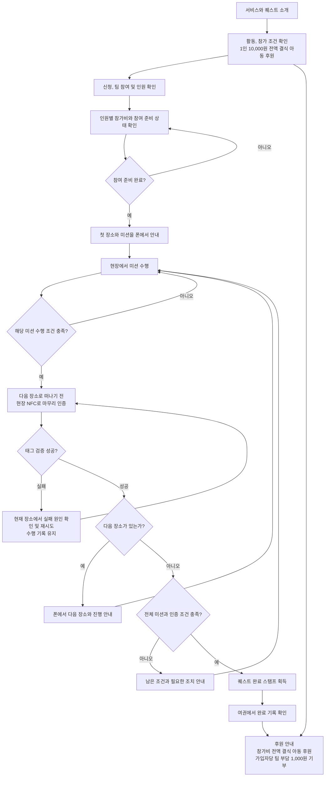

# 노놀 유저플로우: 미션 수행 후 NFC 마무리

수정일: 2026-09-28
기준: 1인 10,000원 전액 결식 아동 후원. 가입자당 팀 부담 1,000원 기부는 별도 캠페인.
이 흐름은 기획 기준이며 실제 결제 방식, 미션 판정 방식, 팀 완료 기준은 별도 확정한다.

## 적용 규칙

- 방문 직후 NFC를 태그하고 미션이 끝난 것으로 처리하지 않는다.
- 미션 수행 여부와 NFC 인증 여부를 별도로 관리한다.
- 개별 미션 인증 성공과 전체 퀘스트 완료 스탬프 획득을 구분한다.
- 포인트와 추가 보상 해제 흐름은 없다.
- 미션 완료의 판정 방식은 미정이다. 위 다이아몬드는 판정 요구를 나타내며 특정 자동 판정이 구현되었다는 뜻이 아니다.
- 결제 처리 방식은 미정이므로 참여 준비 상태 확인으로 표현했다. 실제 운영 전 결제와 인원 조건을 명세에 연결한다.
- 비로그인 소개 열람을 제안하되, 로그인과 가입 방식이 확정되면 참여 진입점에 연결한다.
- 가입 캠페인과 참가비 후원은 서로 다른 항목이며 합산 집계 규칙은 별도 확정한다.
- Base L2 발급은 향후 연결 계획이다. 로컬 검증 완료와 테스트넷 검증 예정이라는 현재 상태를 구분한다.
